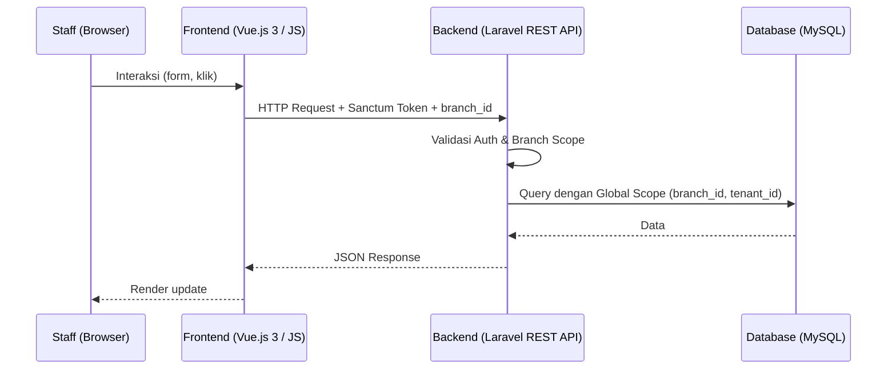
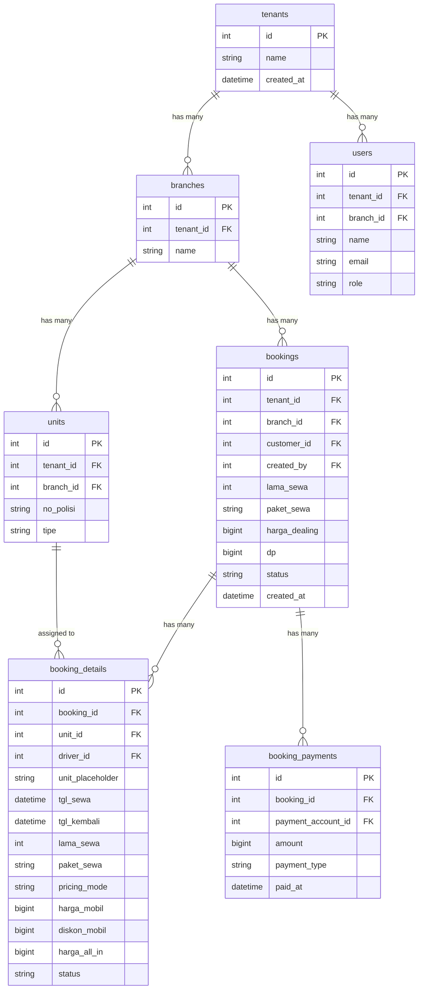

# DRENT — Product Requirements Document
## Part 1 of 7: Overview & Tech Stack

| Dokumen  | PRD — DRENT Car Rental System |
|----------|-------------------------------|
| Versi    | 1.0                           |
| Status   | Draft                         |
| Fase 1   | Internal — Satu tenant, multi-branch |
| Fase 2   | SaaS — Multi-tenant           |

---

## Navigasi Dokumen

| Bagian | File |
|--------|------|
| **Part 1 — Overview & Tech Stack** | `DRENT_PRD_01_overview.md` ← Kamu di sini |
| Part 2 — User & Akses | `DRENT_PRD_02_user_akses.md` |
| Part 3 — Data Master | `DRENT_PRD_03_data_master.md` |
| Part 4 — Booking & Transaksi | `DRENT_PRD_04_booking_transaksi.md` |
| Part 5 — Keuangan & Cek Fisik | `DRENT_PRD_05_keuangan_cek_fisik.md` |
| Part 6 — Modul Pendukung | `DRENT_PRD_06_modul_pendukung.md` |
| Part 7 — Non-Fungsional & Resolved Decisions | `DRENT_PRD_07_nonfungsional.md` |

---

## 1. Overview & Tujuan

### 1.1 Deskripsi Produk

DRENT adalah sistem manajemen operasional rental mobil yang dirancang untuk kebutuhan internal perusahaan. Sistem ini mencakup seluruh siklus transaksi sewa kendaraan—dari booking awal hingga pengembalian unit—termasuk manajemen armada, operasional driver, keuangan, dan inspeksi fisik kendaraan.

Sistem ini **tidak dapat diakses oleh konsumen**. Seluruh input dilakukan oleh tim internal sesuai role masing-masing.

### 1.2 Tujuan Utama

- Digitalisasi dan sentralisasi seluruh proses operasional rental mobil.
- Mendukung model bisnis **rent-to-rent** (unit dari rental lain disewakan ke konsumen).
- Manajemen **multi-branch** dalam satu dashboard terpusat.
- Fondasi arsitektur yang siap dikembangkan menjadi **SaaS multi-tenant**.

### 1.3 Fase Pengembangan

| Fase | Deskripsi |
|------|-----------|
| **Fase 1 (Internal)** | Single tenant, multi-branch. Satu perusahaan rental, beberapa cabang dalam satu database. |
| **Fase 2 (SaaS)** | Multi-tenant. Setiap perusahaan rental memiliki isolasi data sendiri. Direncanakan setelah Fase 1 stabil. |

### 1.4 Ruang Lingkup

**Dalam scope:**
Booking, transaksi sewa, cek fisik, piutang, rent-to-rent, operasional driver, pemeliharaan unit, kas, laporan.

Alur booking dalam scope mencakup booking awal dengan unit fix atau placeholder, penentuan unit melalui detail booking, handle status ke waiting list, checkout, complete, pembayaran, refund, dan ringkasan biaya.

**Luar scope (Fase 1):**
Portal konsumen, online booking publik, integrasi payment gateway eksternal, notifikasi WhatsApp/email.

---

## 2. Tech Stack & Arsitektur

### 2.1 Stack Teknologi

| Komponen | Teknologi |
|----------|-----------|
| Backend | Laravel (PHP) — REST API |
| Frontend | Vue.js 3 + Vite (SPA) — **JavaScript only, tanpa TypeScript** |
| Database | MySQL / PostgreSQL |
| Auth | Laravel Sanctum (SPA token-based) |
| PDF Generation | Laravel DomPDF atau Browsershot |
| File Storage | Laravel Storage (local/S3-compatible) |
| Canvas TTD | Signature Pad (JS library) |
| State Management | Pinia |
| UI Framework | Tailwind CSS + PrimeVue |

> **Catatan Frontend:** Proyek menggunakan Vue.js 3 dengan **JavaScript murni** (`.vue` dan `.js`). Tidak ada `.ts`, `tsconfig.json`, atau type annotation. Semua konfigurasi Vite dikonfigurasi tanpa TypeScript plugin.
> Komponen UI memakai PrimeVue (`DataTable`, `Dialog`, `Toast`, `Dropdown`, `Calendar`, dan komponen form lain) dengan utility styling Tailwind/CSS global.

### 2.2 Pola Arsitektur

- Backend sebagai **pure REST API**, frontend sebagai **SPA terpisah**.
- Semua endpoint diproteksi oleh middleware autentikasi dan middleware branch scope.
- Module activation dikendalikan oleh **tabel konfigurasi di database**, bukan flag hardcode.
- Multi-branch diimplementasikan sebagai **Global Scope pada model Eloquent**, bukan schema terpisah.

### 2.3 Arsitektur Data Flow

### 2.4 Konvensi Operasional Booking

- Booking awal boleh memakai unit fix atau placeholder unit.
- Jika unit masih placeholder, booking belum boleh di-handle ke `waiting_list`.
- Penentuan atau perubahan unit dilakukan dari detail booking melalui modal Tambah Unit / Edit Unit.
- Tombol Handle hanya konfirmasi perubahan status, bukan form input unit/biaya.
- Data booking boleh diedit dari detail booking, kecuali konsumen.
- Setelah detail kendaraan memiliki harga, ringkasan keuangan memakai detail kendaraan sebagai acuan.
- Jika detail kendaraan belum memiliki harga, ringkasan keuangan fallback ke `harga_dealing` booking.
- Harga All In dikalikan `lama_sewa`.
- Tanggal/jam operasional rental dikirim sebagai local datetime (`YYYY-MM-DD HH:mm:ss`) dan tidak dikonversi ke UTC di frontend.
- Default jam sewa adalah 07:00 dan default jam kembali adalah 23:59.
- `lama_sewa` dipilih dari 1-99 dan otomatis menghitung tanggal kembali.

### 2.5 Pertimbangan SaaS (Fase 2)

> ⚠️ **Non-negotiable:** Seluruh model harus memiliki kolom `tenant_id` dari Fase 1. Jika kolom ini tidak ada sejak awal, migrasi ke multi-tenant akan memerlukan perubahan skema masif.

**Rekomendasi:** Tambahkan `tenant_id` sejak Fase 1 meski hanya ada satu tenant. Isi default dengan ID perusahaan saat ini.

### 2.6 Database Schema - Gambaran Umum

> Detail schema per modul dijelaskan di masing-masing bagian PRD terkait.

---

*Lanjut ke: [Part 2 — User & Akses](DRENT_PRD_02_user_akses.md)*
