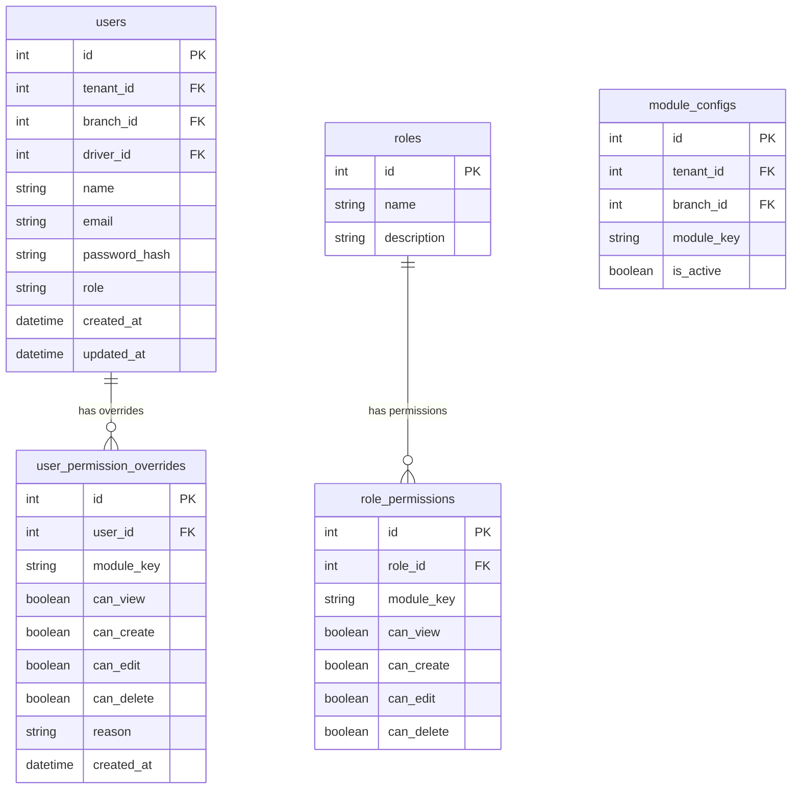
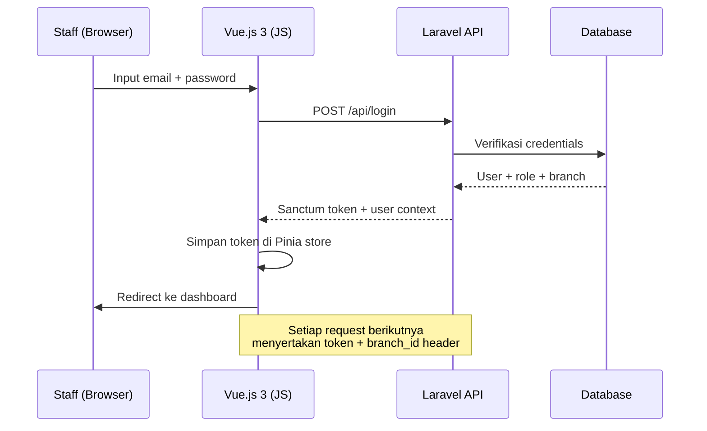

# DRENT — Product Requirements Document
## Part 2 of 7: Manajemen User & Akses

---

## Navigasi Dokumen

| Bagian | File |
|--------|------|
| Part 1 — Overview & Tech Stack | `DRENT_PRD_01_overview.md` |
| **Part 2 — User & Akses** | `DRENT_PRD_02_user_akses.md` ← Kamu di sini |
| Part 3 — Data Master | `DRENT_PRD_03_data_master.md` |
| Part 4 — Booking & Transaksi | `DRENT_PRD_04_booking_transaksi.md` |
| Part 5 — Keuangan & Cek Fisik | `DRENT_PRD_05_keuangan_cek_fisik.md` |
| Part 6 — Modul Pendukung | `DRENT_PRD_06_modul_pendukung.md` |
| Part 7 — Non-Fungsional & Resolved Decisions | `DRENT_PRD_07_nonfungsional.md` |

---

## 3. Manajemen User & Akses

### 3.1 Role Standar

| Role | Akses Default Utama |
|------|---------------------|
| **Super Admin** | Full akses seluruh sistem, konfigurasi tenant & branch. |
| **Admin Branch** | Full akses dalam branch sendiri, kecuali konfigurasi tenant. |
| **Customer Service (CS)** | Input booking, handle transaksi, update status sewa. |
| **Finance** | Generate invoice, kelola piutang, input/validasi bon driver, kelola kas, input saldo driver. |
| **Cek Fisik** | Input laporan inspeksi kendaraan, tanda tangan digital. |
| **Surveyor** | Registrasi konsumen, pengisian data member. |
| **Teknisi** | Input biaya dan kegiatan pemeliharaan unit. |
| **Driver** | Input bon operasional sendiri via mobile. Akses terbatas hanya ke modul bon dan saldo pribadi. |

### 3.1.1 Catatan Role Driver

- Setiap driver **tetap** harus memiliki akun dengan role `Driver`.
- Driver mengakses sistem via **mobile browser** untuk upload bon operasional.
- Untuk **driver tidak tetap** (lepas/freelance): driver tidak perlu akun. Bon diserahkan secara fisik ke Finance, dan Finance yang menginput ke sistem.
- Relasi antara akun `users` (role Driver) dan data `drivers` menggunakan kolom `driver_id` di tabel `users`.

### 3.2 Sistem Permission (Dua Lapis)

Sistem permission berjalan dua lapis:

1. **Role-level:** Setiap role memiliki kumpulan akses modul default.
2. **User-level override:** Permission spesifik dapat ditambah atau dicabut dari user individual, tanpa mengubah role.

> **Contoh:** Tim CS secara default tidak memiliki akses modul Cek Fisik. Namun untuk branch tertentu dengan tim kecil, user CS tertentu bisa di-override agar bisa akses Cek Fisik. Override ini disimpan di tabel `user_permission_overrides`, terpisah dari tabel `role_permissions`.

### 3.3 Manajemen Modul per Level

| Level | Siapa yang Mengontrol |
|-------|-----------------------|
| Tenant (Fase 2) | Super Admin mengaktifkan/nonaktifkan modul per tenant. |
| Branch | Admin Branch mengaktifkan/nonaktifkan modul per branch. |
| Role | Admin mengatur akses modul default per role. |
| User | Admin dapat override akses modul per user individual. |

### 3.4 Database Schema — User & Permission

### 3.5 Alur Autentikasi

### 3.6 Aturan Validasi Akses

- Setiap API request divalidasi `branch_id` dari user yang login. User tidak dapat mengakses data branch lain.
- Role & permission **dicek di middleware backend**, tidak hanya di frontend (frontend hanya untuk UX).
- Audit log wajib untuk perubahan data kritis: status transaksi, invoice, pembayaran.

---

*Kembali ke: [Part 1 — Overview & Tech Stack](DRENT_PRD_01_overview.md)*
*Lanjut ke: [Part 3 — Data Master](DRENT_PRD_03_data_master.md)*
