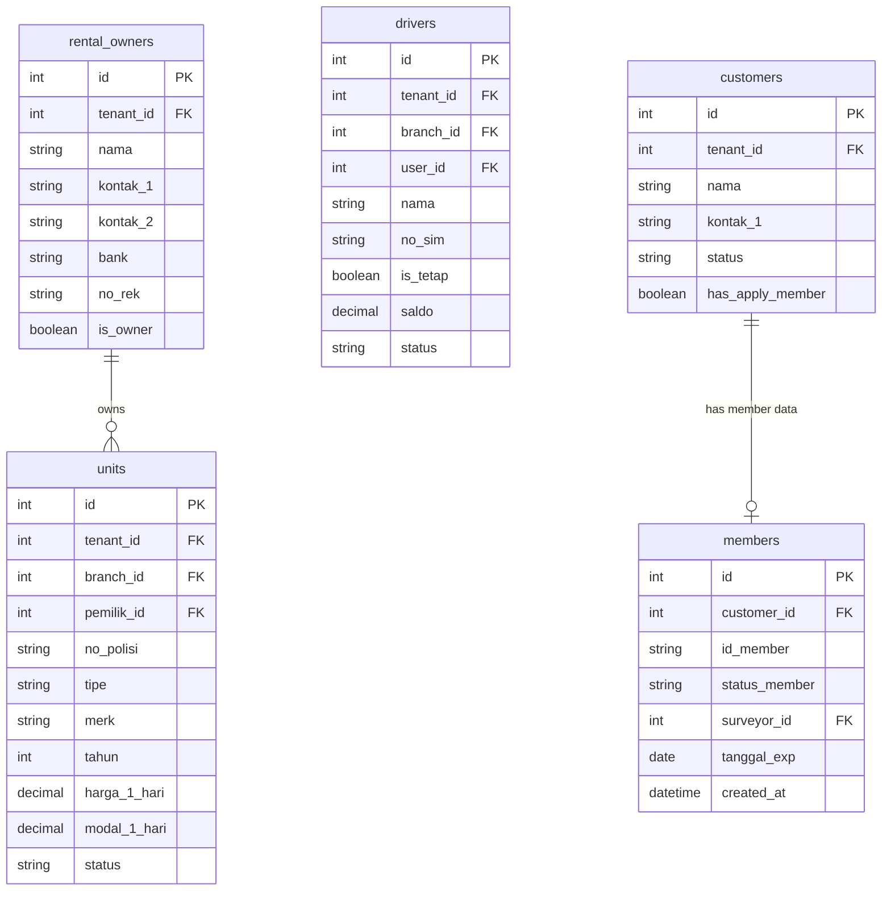

# DRENT — Product Requirements Document
## Part 3 of 7: Modul Data Master

---

## Navigasi Dokumen

| Bagian | File |
|--------|------|
| Part 1 — Overview & Tech Stack | `DRENT_PRD_01_overview.md` |
| Part 2 — User & Akses | `DRENT_PRD_02_user_akses.md` |
| **Part 3 — Data Master** | `DRENT_PRD_03_data_master.md` ← Kamu di sini |
| Part 4 — Booking & Transaksi | `DRENT_PRD_04_booking_transaksi.md` |
| Part 5 — Keuangan & Cek Fisik | `DRENT_PRD_05_keuangan_cek_fisik.md` |
| Part 6 — Modul Pendukung | `DRENT_PRD_06_modul_pendukung.md` |
| Part 7 — Non-Fungsional & Resolved Decisions | `DRENT_PRD_07_nonfungsional.md` |

---

## 4. Modul Data Master

### 4.1 Data Pemilik Rental

Menyimpan data mitra penyedia kendaraan (untuk rent-to-rent) maupun perusahaan sendiri.

| Field | Keterangan |
|-------|------------|
| `nama` | Nama pemilik / perusahaan rental. |
| `kontak_1`, `kontak_2` | Nomor telepon utama dan cadangan. |
| `alamat`, `kota` | Alamat lengkap. |
| `bank`, `no_rek`, `atas_nama` | Informasi rekening untuk pembayaran rent-to-rent. |
| `is_owner` | Boolean. Jika `true`, unit milik pemilik ini dianggap aset sendiri (tidak masuk hutang rent-to-rent). |

> **Catatan:** Lebih dari satu pemilik rental dapat ditandai sebagai `is_owner = true`. Ini memungkinkan struktur kepemilikan split (misal: beberapa entitas bisnis dalam satu grup yang sama).

### 4.2 Data Mobil (Unit Kendaraan)

| Field | Keterangan |
|-------|------------|
| `tipe`, `merk`, `tahun` | Identitas kendaraan. |
| `no_polisi` | Nomor plat (harus unik). |
| `pemilik_id` | Relasi ke Data Pemilik Rental. |
| `harga_1_hari`, `harga_1_minggu`, `harga_1_bulan` | Harga jual ke konsumen. |
| `modal_1_hari`, `modal_1_minggu`, `modal_1_bulan` | Harga modal (dasar pembayaran ke pemilik untuk rent-to-rent). |
| `foto` | Upload foto unit (multiple). |
| `status` | `Aktif` / `Tidak Aktif` / `Dalam Servis`. |

### 4.3 Data Supir (Driver)

| Field | Keterangan |
|-------|------------|
| `nama`, `alamat`, `kota` | Identitas driver. |
| `no_sim` | Nomor SIM. |
| `kontak_1`, `kontak_2` | Kontak utama dan darurat. |
| `saldo` | Saldo operasional saat ini. Dikelola via modul Operasional Driver. |
| `status` | `Aktif` / `Tidak Aktif`. |
| `is_tetap` | Boolean. Jika `true`, driver memiliki akun login (role `Driver`). Jika `false`, driver tidak tetap — bon diinput oleh Finance. |
| `user_id` | FK ke tabel `users`. Hanya diisi jika `is_tetap = true`. |

### 4.4 Data Pelanggan

| Field | Keterangan |
|-------|------------|
| `nama` | Nama lengkap pelanggan. |
| `kontak_1`, `kontak_2` | Nomor telepon. |
| `alamat`, `kota` | Alamat. |
| `status` | `Umum` / `Member` / `Corporate` / `Redflag` / `Blacklist`. |
| `has_apply_member` | Boolean. Menandai apakah pelanggan pernah mengajukan permohonan member. |

> ⚠️ **Peringatan UI:** Pelanggan dengan status `Redflag` atau `Blacklist` **harus ditampilkan peringatan jelas** saat dipilih di form booking.

### 4.5 Data Member

Data member adalah perluasan dari Data Pelanggan untuk pelanggan yang mengajukan hak sewa **lepas kunci**.

#### Informasi Identitas & Dokumen

- Foto wajah pelanggan.
- Kartu identitas: KTP / SIM / Paspor (upload foto).
- Dokumen pendukung: KK atau dokumen lain (upload, bisa lebih dari satu).

#### Informasi Pekerjaan

- Nama tempat kerja, alamat, nomor kontak, jabatan, nama atasan.
- Status pekerjaan: `Pelajar` / `PNS` / `Swasta` / `Wiraswasta`.

#### Informasi Keluarga & Sosial

- Penanggung jawab: nama, kontak, hubungan dengan pelanggan.
- Data orang tua: nama, alamat, kontak.
- Status pernikahan.
- Keadaan rumah: `Ruko` / `Permanen` / `Semi Permanen`.
- Lokasi rumah: `Umum` / `Biasa` / `Gang`.

#### Informasi Status Member

| Field | Keterangan |
|-------|------------|
| `id_member` | Nomor member unik. |
| `status_member` | `Pending` / `Aktif` / `Tidak Aktif` / `Ditolak`. |
| `tanggal_survey` | Tanggal surveyor melakukan verifikasi lapangan. |
| `tanggal_aktif` | Tanggal member diaktifkan. |
| `tanggal_exp` | Tanggal kedaluwarsa member. |
| `surveyor_id` | Relasi ke user yang bertugas sebagai surveyor. |
| `catatan` | Keterangan bebas dari surveyor. |
| `tanggal_diperbarui` | Timestamp terakhir data diubah. |

> Pengisian formulir member penuh dilakukan oleh Surveyor. Dalam kasus tertentu, Admin dapat langsung mengaktifkan status member tanpa melalui proses pengisian lengkap (**fast-track activation**).

### 4.6 Database Schema — Data Master

---

*Kembali ke: [Part 2 — User & Akses](DRENT_PRD_02_user_akses.md)*
*Lanjut ke: [Part 4 — Booking & Transaksi](DRENT_PRD_04_booking_transaksi.md)*
