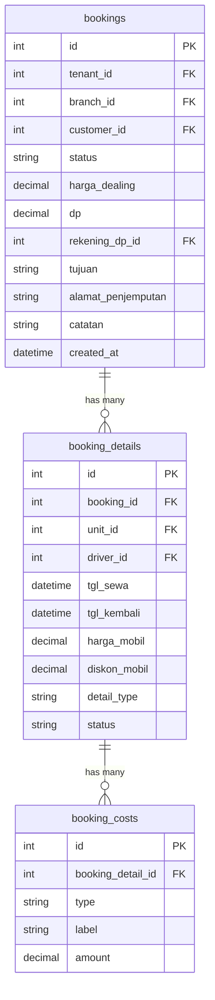

# DRENT — Product Requirements Document
## Part 4 of 7: Modul Booking & Transaksi Sewa

---

## Navigasi Dokumen

| Bagian | File |
|--------|------|
| Part 1 — Overview & Tech Stack | `DRENT_PRD_01_overview.md` |
| Part 2 — User & Akses | `DRENT_PRD_02_user_akses.md` |
| Part 3 — Data Master | `DRENT_PRD_03_data_master.md` |
| **Part 4 — Booking & Transaksi** | `DRENT_PRD_04_booking_transaksi.md` ← Kamu di sini |
| Part 5 — Keuangan & Cek Fisik | `DRENT_PRD_05_keuangan_cek_fisik.md` |
| Part 6 — Modul Pendukung | `DRENT_PRD_06_modul_pendukung.md` |
| Part 7 — Non-Fungsional & Resolved Decisions | `DRENT_PRD_07_nonfungsional.md` |

---

## 5. Modul Booking & Transaksi Sewa

### 5.1 Konsep Multi-Unit dalam Satu Transaksi

Satu transaksi sewa dapat mencakup lebih dari satu unit kendaraan atau lebih dari satu periode dengan kendaraan/driver berbeda. Ini bukan bug — ini adalah **kebutuhan bisnis** yang harus didukung oleh skema data.

> **Contoh 1:** Konsumen sewa 1–5 Maret. Tgl 1–2 dengan Avanza A + Driver X. Tgl 3–5 dengan Avanza A + Driver Y.
>
> **Contoh 2:** Konsumen sewa 1–5 Maret. Tgl 1–2 Avanza A, tgl 3–5 Innova B (rolling karena Avanza masuk servis).
>
> **Contoh 3:** Konsumen sewa 2 unit sekaligus tgl 1–3 Maret.

**Implikasi skema:** Satu `booking` memiliki banyak `booking_detail` (per unit, per periode).

### 5.2 Tampilan UI Booking

#### View 1: Kalender Timeline (Gantt-style)

- Kolom pertama: Tipe kendaraan + Nomor Polisi + Nama Pemilik (satu baris per unit).
- Kolom berikutnya: Tanggal, rentang H–10 sampai H+20 dari hari ini (total 30 hari).
- Bar pada baris unit menunjukkan booking aktif, akan datang, atau baru selesai.
- Klik sel kosong di baris unit tertentu → form tambah booking dengan unit dan tanggal pre-filled.

> ⚠️ **Performa:** Kalender harus dapat merender 50+ unit tanpa lag. Lihat [Part 7](DRENT_PRD_07_nonfungsional.md) untuk requirement performa.

#### View 2: Kalender Bulanan

- Tampilan bulan standar.
- Setiap hari yang memiliki transaksi aktif diberi penanda (dot / badge).
- Klik hari → daftar transaksi pada hari tersebut.

### 5.3 Alur Status Transaksi

```
Follow Up → Confirm → Waiting List → Rental Unit → Dikembalikan
```

| Status | Kondisi & Transisi |
|--------|--------------------|
| **Follow Up** | Booking dibuat tanpa DP. CS harus menindaklanjuti ke konsumen. Bisa diubah manual ke Confirm. |
| **Confirm** | DP diterima ATAU diubah manual. CS kemudian melakukan proses "Handle Booking". |
| **Waiting List** | Booking sudah di-handle (unit, driver, biaya ditentukan). Menunggu keberangkatan. |
| **Rental Unit** | Unit sudah melewati cek fisik keberangkatan dan sedang dalam perjalanan. Detail biaya terkunci. |
| **Dikembalikan** | Unit kembali, cek fisik kepulangan selesai. CS mengubah status ini secara manual. |

### 5.4 Proses Input Booking Awal (CS)

| Field | Keterangan |
|-------|------------|
| Konsumen | Pilih dari daftar atau input baru. Autocomplete mencakup data pelanggan + data pemilik rental (untuk rent-to-rent B2B). |
| Jenis Kendaraan | Bisa hanya tipe (misal: Avanza) jika unit belum ditentukan, atau pilih unit spesifik. |
| Tanggal Sewa | Dengan jam. Default: `07:00`. |
| Tanggal Kembali | Dengan jam. Default: `23:59`. |
| Lama Sewa | N × paket (1 hari / 1 minggu / 1 bulan). |
| Tujuan | Destinasi perjalanan. |
| Alamat Penjemputan | Lokasi jemput konsumen. |
| Catatan | Keterangan bebas. |
| Harga Dealing | Harga keseluruhan hasil negosiasi CS ke konsumen. Diisi manual. |
| DP (opsional) | Pilih rekening penerima. Jika diisi → status `Confirm`. Jika kosong → status `Follow Up`. |

### 5.5 Proses Handle Booking (Confirm → Waiting List)

#### Penentuan Harga

- **Harga Paket:** Konsumen menerima invoice dengan harga paket yang telah ditentukan. Detail biaya internal tidak tampil di invoice. Selisih antara harga paket dan biaya aktual adalah margin perusahaan.
- **Harga Non-Paket:** Harga dihitung dari akumulasi komponen biaya yang diinput CS.

#### Detail Operasional yang Ditentukan

| Field | Keterangan |
|-------|------------|
| Unit Kendaraan | Pilih unit dengan nomor polisi. Jika unit milik rental lain, otomatis tercatat sebagai hutang rent-to-rent. |
| Driver | Pilih dari daftar driver aktif (opsional). |
| Tanggal & Lama Sewa | Konfirmasi atau penyesuaian dari data booking awal. |
| Harga Mobil | Otomatis dari data unit × lama sewa. Bisa dioverride. |
| Diskon Harga Mobil | Total diskon dalam nominal. |

#### Komponen Biaya Operasional

Semua komponen diisi dalam nominal total (tidak dikalikan lama sewa secara otomatis):

- Harga Driver (jika ada)
- BBM (jika ada)
- Tol (jika ada)
- Uang Makan (jika ada)
- Penginapan (jika ada)
- Parkir (jika ada)
- Antar Jemput (jika ada)
- Biaya Lainnya (input bebas, redaksi dapat dikustomisasi, bisa lebih dari satu item)
- Diskon Operasional (jika ada)

> Satu transaksi dapat memiliki lebih dari satu `booking_detail` (per unit / per periode). Setiap `booking_detail` memiliki komponen biayanya sendiri.

### 5.6 Modifikasi saat Status Rental Unit

Setelah status `Rental Unit`, detail biaya terkunci. Perubahan hanya dapat dilakukan melalui mekanisme berikut:

| Mekanisme | Penjelasan |
|-----------|------------|
| **Extend Rental** | Penambahan hari sewa. Diperlakukan sebagai `detail` baru dengan status `extend` pada transaksi yang sama. |
| **Berhenti Mendadak** | Pengurangan hari sewa. Sistem menghitung nominal refund. |
| **Rolling Mobil** | Pergantian unit di tengah sewa karena trouble. Invoice pertama disesuaikan, unit pengganti ditambahkan sebagai detail baru dengan status `rolling`. |
| **Biaya Operasional Tambahan** | Termasuk penambahan diskon. Ditambahkan sebagai item baru, tidak mengubah yang sudah ada. |
| **Diskon Tambahan Harga Mobil** | Ditambahkan sebagai adjustment, bukan mengubah harga awal. |
| **Denda** | Input nominal dan keterangan. Ditambahkan oleh Finance setelah laporan dari tim Cek Fisik. |

### 5.7 Input Transaksi Langsung (Tanpa Booking)

Transaksi dapat langsung diinput tanpa melalui proses booking terlebih dahulu. Semua data ditentukan di awal dan transaksi langsung tersimpan dengan status **Waiting List**.

### 5.8 Database Schema — Booking & Transaksi



---

*Kembali ke: [Part 3 — Data Master](DRENT_PRD_03_data_master.md)*
*Lanjut ke: [Part 5 — Keuangan & Cek Fisik](DRENT_PRD_05_keuangan_cek_fisik.md)*
