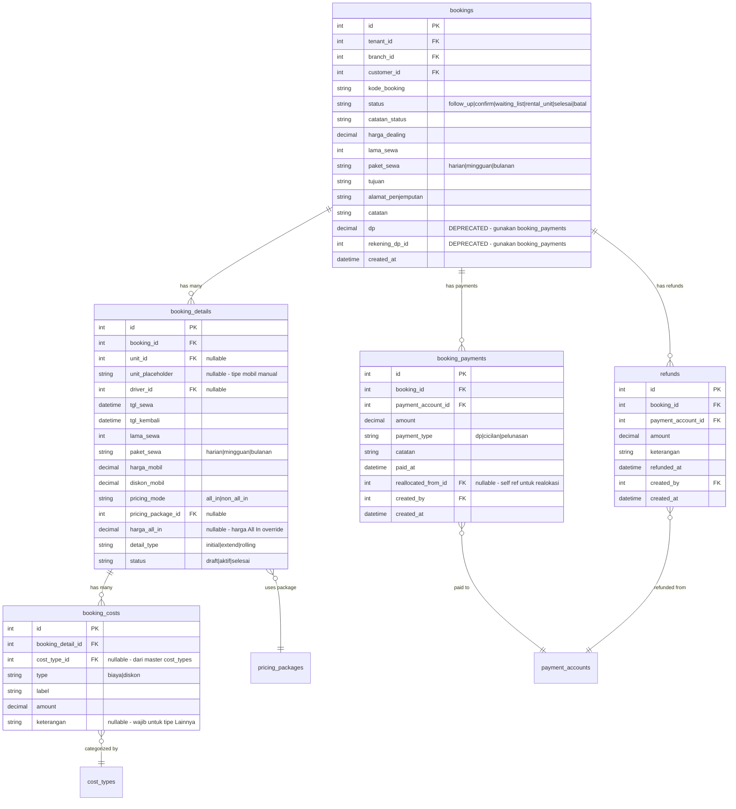

# DRENT — Product Requirements Document
## Part 4 of 7: Modul Booking & Transaksi Sewa

---

## Navigasi Dokumen

| Bagian | File |
|--------|------|
| Part 1 — Overview & Tech Stack | `DRENT_PRD_01_overview.md` |
| Part 2 — User & Akses | `DRENT_PRD_02_user_akses.md` |
| Part 3 — Data Master | `DRENT_PRD_03_data_master.md` |
| **Part 4 — Booking & Transaksi** | `DRENT_PRD_04_booking_transaksi.md` ← Kamu di sini |
| Part 5 — Keuangan & Cek Fisik | `DRENT_PRD_05_keuangan_cek_fisik.md` |
| Part 6 — Modul Pendukung | `DRENT_PRD_06_modul_pendukung.md` |
| Part 7 — Non-Fungsional & Resolved Decisions | `DRENT_PRD_07_nonfungsional.md` |

---

## 5. Modul Booking & Transaksi Sewa

### 5.1 Konsep Multi-Unit dalam Satu Transaksi

Satu transaksi sewa dapat mencakup lebih dari satu unit kendaraan atau lebih dari satu periode dengan kendaraan/driver berbeda. Ini bukan bug — ini adalah **kebutuhan bisnis** yang harus didukung oleh skema data.

> **Contoh 1:** Konsumen sewa 1–5 Maret. Tgl 1–2 dengan Avanza A + Driver X. Tgl 3–5 dengan Avanza A + Driver Y.
>
> **Contoh 2:** Konsumen sewa 1–5 Maret. Tgl 1–2 Avanza A, tgl 3–5 Innova B (rolling karena Avanza masuk servis).
>
> **Contoh 3:** Konsumen sewa 2 unit sekaligus tgl 1–3 Maret.

**Implikasi skema:** Satu `booking` memiliki banyak `booking_detail` (per unit, per periode).

### 5.2 Tampilan UI Booking

#### View 1: Kalender Timeline (Gantt-style)

- Kolom pertama: Tipe kendaraan + Nomor Polisi + Nama Pemilik (satu baris per unit).
- Kolom berikutnya: Tanggal, rentang H–10 sampai H+20 dari hari ini (total 30 hari).
- Bar pada baris unit menunjukkan booking aktif, akan datang, atau baru selesai.
- Klik sel kosong di baris unit tertentu → form tambah booking dengan unit dan tanggal pre-filled.

> ⚠️ **Performa:** Kalender harus dapat merender 50+ unit tanpa lag. Lihat [Part 7](DRENT_PRD_07_nonfungsional.md) untuk requirement performa.

#### View 2: Kalender Bulanan

- Tampilan bulan standar.
- Setiap hari yang memiliki transaksi aktif diberi penanda (dot / badge).
- Klik hari → daftar transaksi pada hari tersebut.

### 5.3 Alur Status Transaksi

```
Follow Up → Confirm → Waiting List → Rental Unit → Selesai
                                                    ↓
                          (Batal ← dari status mana pun)
```

| Status | Kondisi & Transisi |
|--------|-----------|
| **Follow Up** | Booking dibuat tanpa DP. CS harus menindaklanjuti ke konsumen. CS bisa menambahkan pembayaran DP, mengedit data booking, atau mengubah status manual ke Confirm meski tanpa DP. |
| **Confirm** | DP diterima ATAU diubah manual oleh CS. CS kemudian melakukan proses "Handle Booking" untuk menentukan unit, driver, biaya, dan mode harga. Setelah di-handle, status berubah ke Waiting List. |
| **Waiting List** | Booking sudah di-handle (unit, driver, biaya ditentukan). Data booking masih bisa diubah selama di status ini. Menunggu hari keberangkatan. Pada hari H, CS melakukan **Checkout**. |
| **Rental Unit** | Unit sudah di-checkout dan sedang dalam perjalanan. Detail booking **terkunci** — tidak bisa diubah lagi. Modifikasi hanya melalui mekanisme: Extend, Rolling, Tambah Biaya, atau Batal. Status unit kendaraan berubah menjadi `Out`. |
| **Selesai** | Unit kembali, CS mengubah status menjadi Selesai. Status unit kendaraan kembali ke `Aktif`. Jika ada sisa tagihan yang belum dibayar, akan masuk ke modul piutang (dikembangkan terpisah). |
| **Batal** | Transaksi dibatalkan. Bisa dilakukan dari status mana pun. Jika ada pembayaran yang perlu dikembalikan, CS membuat record refund. Status unit kembali ke `Aktif` jika sebelumnya `Out`. |

### 5.4 Proses Input Booking Awal (CS)

| Field | Keterangan |
|-------|------------|
| Konsumen | Pilih dari daftar atau tambah konsumen baru (minimal: nama, kontak, kota). Autocomplete mencakup data pelanggan. Warning jika Redflag, blokir jika Blacklist. |
| Tanggal Sewa | Dengan jam. Default: `07:00`. Diinput manual oleh CS. |
| Tanggal Kembali | Dengan jam. Default: `23:59`. Diinput manual oleh CS. |
| Lama Sewa | Angka numerik (misal: 3). |
| Paket Sewa | Harian / Mingguan / Bulanan. Harga paket sudah ada di data master unit. |
| Jenis Kendaraan | Bisa pilih unit yang sudah ada (dropdown), atau ketik manual tipe mobil (placeholder). Unit definitif bisa ditentukan saat booking sudah fix. |
| Harga Dealing | Harga keseluruhan hasil negosiasi CS ke konsumen. Diisi manual. **Harga ini hanya sebagai acuan/pengingat CS** — total tagihan ke konsumen ditentukan setelah proses Handle. |
| Alamat Penjemputan | Lokasi jemput konsumen. |
| Tujuan | Destinasi perjalanan. |
| Catatan Sewa | Keterangan bebas. |
| Pembayaran DP (opsional) | Nominal DP + pilih akun pembayaran dari tabel `payment_accounts` (sesuai branch). Jika diisi → status `Confirm`. Jika kosong → status `Follow Up`. Pembayaran tercatat di tabel `booking_payments`. |

> **Perhitungan hari sewa:** Menggunakan nilai `lama_sewa × paket`, **bukan** dari selisih tanggal sewa dan tanggal kembali. Tanggal kembali diinput manual dan bersifat informatif.

### 5.4.1 Manajemen Pembayaran Booking

Seluruh pembayaran terkait booking (DP, cicilan, pelunasan) dicatat dalam tabel `booking_payments`.

| Fitur | Keterangan |
|-------|------------|
| **Tambah Pembayaran** | CS dapat menambahkan pembayaran kapan saja selama booking belum berstatus Selesai atau Batal. Setiap pembayaran mencatat: nominal, akun pembayaran, tipe (dp/cicilan/pelunasan), catatan, dan tanggal bayar. |
| **Realokasi Pembayaran** | Jika ada kelebihan bayar di booking A, CS dapat merealokasi sisa saldo ke booking B milik konsumen yang sama. Tercatat sebagai payment baru di booking B dengan referensi ke payment asal (`reallocated_from_id`). |
| **Computed Values** | `total_payments` = sum semua pembayaran. `sisa_tagihan` = total tagihan − total_payments. |

### 5.5 Proses Handle Booking (Confirm → Waiting List)

Setelah status `Confirm`, CS melakukan proses "Handle" untuk menentukan detail operasional dan biaya. Setelah di-handle, status booking berubah ke `Waiting List`.

#### Detail Operasional yang Ditentukan

| Field | Keterangan |
|-------|------------|
| Unit Kendaraan | Pilih unit dengan nomor polisi. Jika unit milik rental lain, otomatis tercatat sebagai hutang rent-to-rent. |
| Driver | Pilih dari daftar driver aktif (opsional). |
| Lama Sewa | Konfirmasi atau penyesuaian dari data booking awal. |
| Paket Sewa | Harian / Mingguan / Bulanan. |
| Harga Mobil | Otomatis dari data unit berdasarkan paket. Bisa dioverride. |
| Diskon Harga Mobil | Total diskon dalam nominal. |
| Alamat Penjemputan | Konfirmasi atau penyesuaian. |
| Tujuan | Konfirmasi atau penyesuaian. |

#### Penentuan Mode Harga

CS memilih salah satu mode harga untuk menentukan tagihan ke konsumen:

- **Harga All In:** CS memilih paket dari tabel `pricing_packages` atau menginput harga All In manual. Tagihan ke konsumen = harga All In. Total biaya internal (harga sewa + biaya operasional) hanya menjadi **catatan internal** dan tidak muncul di invoice. Selisih antara harga All In dan biaya aktual adalah margin perusahaan.
- **Harga Non All In:** Tagihan ke konsumen dihitung dari akumulasi seluruh komponen biaya yang diinput CS.

> **Contoh All In:** Harga All In = Rp 1.000.000, total internal = Rp 700.000. Konsumen mendapat tagihan Rp 1.000.000.

#### Komponen Biaya Operasional

Kategori biaya diambil dari tabel master `cost_types` (dinamis, bisa ditambah oleh admin). Semua komponen diisi dalam nominal total (**tidak dikalikan lama sewa**):

- Kategori default: Driver, BBM, Tol, Uang Makan, Penginapan, Parkir, Antar Jemput, Lainnya
- Untuk tipe "Lainnya", CS **wajib** mengisi keterangan
- Bisa menambahkan lebih dari satu item per kategori
- Diskon operasional diinput sebagai biaya dengan tipe `diskon`

#### Perhitungan Harga

```
Harga Sewa   = (harga_mobil − diskon_mobil) × lama_sewa
Biaya Lainnya = sum(semua booking_costs)       ← TIDAK dikalikan lama_sewa
Total Internal = Harga Sewa + Biaya Lainnya

Tagihan Konsumen:
  • Jika All In    = harga_all_in
  • Jika Non All In = Total Internal
```

> Satu transaksi dapat memiliki lebih dari satu `booking_detail` (per unit / per periode). Setiap `booking_detail` memiliki komponen biayanya sendiri.

> **Total tagihan ke konsumen ditentukan setelah proses Handle.** Harga dealing yang diinput saat booking awal hanya sebagai acuan/pengingat untuk CS.

### 5.5.1 Proses Checkout (Waiting List → Rental Unit)

Pada hari H keberangkatan, CS melakukan **Checkout** untuk mengubah status booking.

| Langkah | Detail |
|---------|--------|
| 1. CS klik "Checkout" | Tombol hanya muncul saat status = `Waiting List`. |
| 2. Popup Konfirmasi Cek Fisik | Dialog: "Apakah kendaraan sudah di Cek Fisik?" dengan opsi: (a) Ya, lanjutkan checkout, (b) Checkout tanpa Cek Fisik, (c) Batal. |
| 3. Status berubah | Booking → `Rental Unit`. Unit kendaraan → `Out`. Booking detail → `aktif`. |

> **Catatan:** Modul cek fisik penuh belum dikembangkan. Saat ini hanya popup konfirmasi sebagai placeholder.

### 5.5.2 Proses Selesai (Rental Unit → Selesai)

Setelah unit kembali, CS mengubah status booking menjadi Selesai.

| Langkah | Detail |
|---------|--------|
| 1. CS klik "Selesai" | Tombol hanya muncul saat status = `Rental Unit`. |
| 2. Popup Konfirmasi Cek Fisik | Dialog: "Apakah kendaraan sudah di Cek Fisik Kepulangan?" dengan opsi serupa seperti checkout. |
| 3. Status berubah | Booking → `Selesai`. Unit kendaraan → `Aktif`. Booking detail → `selesai`. |
| 4. Sisa tagihan | Jika ada sisa tagihan yang belum dibayar, akan tercatat sebagai piutang (modul piutang dikembangkan di fase berikutnya). |

### 5.6 Modifikasi saat Status Rental Unit

Setelah status `Rental Unit`, detail booking **terkunci** — data yang sudah ada tidak bisa diubah. Modifikasi hanya dapat dilakukan melalui mekanisme berikut:

#### Extend (Perpanjang Sewa)

Penambahan lama sewa. Diperlakukan sebagai `booking_detail` baru dengan `detail_type = extend`.

| Field | Keterangan |
|-------|------------|
| Unit Kendaraan | Pilih ulang — bisa unit yang sama atau berbeda jika extend menggunakan unit lain. |
| Driver | Pilih ulang. |
| Tanggal Sewa | **Wajib H+1** dari tanggal kembali booking detail sebelumnya. |
| Tanggal Kembali | Input manual. |
| Lama Sewa & Paket | Input baru untuk periode extend. |
| Biaya Operasional | Input lengkap dari master `cost_types` (driver, bbm, tol, dll). |
| Mode Harga | Pilih All In / Non All In untuk periode extend ini. |

#### Rolling Mobil (Ganti Unit)

Pergantian unit di tengah sewa karena trouble/masalah. Terdiri dari 2 langkah:

| Langkah | Detail |
|---------|--------|
| 1. Adjust detail lama | Sesuaikan lama sewa, harga, dan data detail sebelumnya agar sesuai dengan pemakaian aktual sampai tanggal rolling. Status detail lama → `selesai`. |
| 2. Buat detail baru | Form lengkap seperti handle booking: unit baru, driver, tanggal sewa, tanggal kembali, lama sewa, paket, biaya-biaya, mode harga. `detail_type = rolling`. |

#### Biaya Operasional Tambahan

Biaya tambahan (fee, BBM, tol, dll) dapat ditambahkan kapan saja selama status `Rental Unit`. Ditambahkan sebagai item baru dari master `cost_types`, **tidak mengubah biaya yang sudah ada**.

#### Batal (Pembatalan Transaksi)

Transaksi dibatalkan. CS membuat record refund jika ada pembayaran yang perlu dikembalikan.

| Field Refund | Keterangan |
|-------------|------------|
| Nominal | Jumlah uang yang dikembalikan ke konsumen. |
| Keterangan | Alasan pembatalan / catatan. |
| Akun Pembayaran | Akun yang digunakan untuk mengembalikan dana. |

Setelah batal: booking → `Batal`, unit → `Aktif` (jika sebelumnya `Out`). Record refund tersimpan di tabel `refunds`.

### 5.6.1 Peringatan Keterlambatan

Jika tanggal kembali sudah terlewat (`tgl_kembali < sekarang`) dan status booking masih `Rental Unit`, sistem menampilkan **indikator peringatan keterlambatan** pada baris booking di halaman list. Ini membantu CS untuk segera menindaklanjuti.

### 5.7 Input Transaksi Langsung (Tanpa Booking)

Transaksi dapat langsung diinput tanpa melalui proses booking terlebih dahulu. Semua data ditentukan di awal dan transaksi langsung tersimpan dengan status **Waiting List**.

### 5.8 Database Schema — Booking & Transaksi



---

*Kembali ke: [Part 3 — Data Master](DRENT_PRD_03_data_master.md)*
*Lanjut ke: [Part 5 — Keuangan & Cek Fisik](DRENT_PRD_05_keuangan_cek_fisik.md)*
