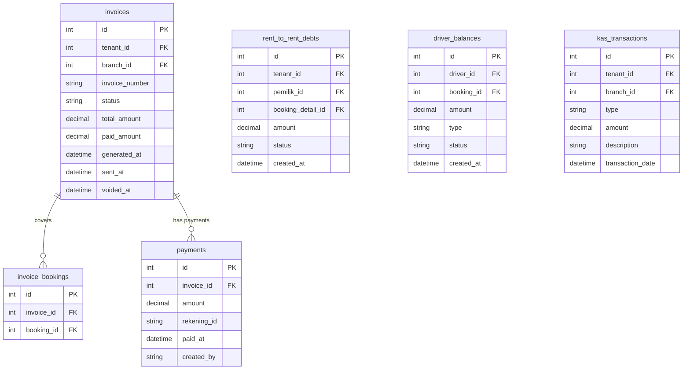
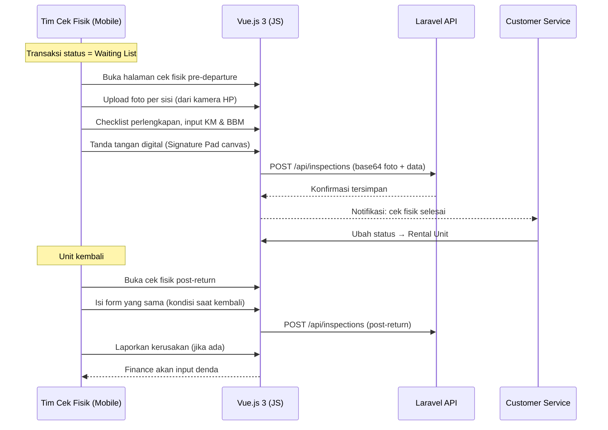
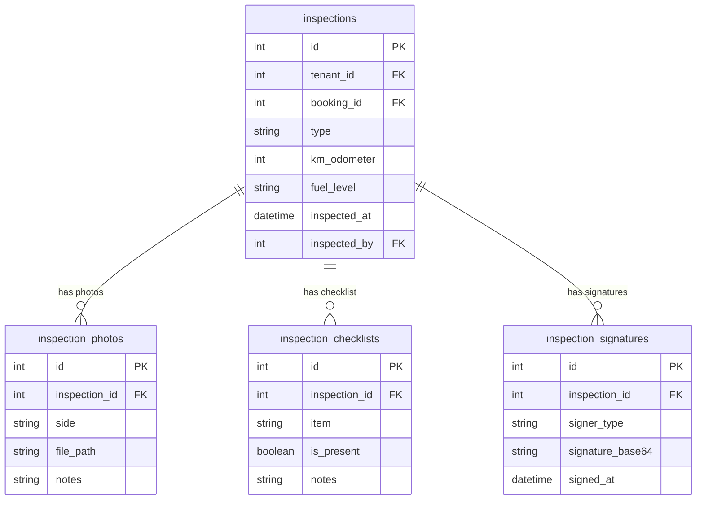

# DRENT — Product Requirements Document
## Part 5 of 7: Modul Keuangan & Cek Fisik

---

## Navigasi Dokumen

| Bagian | File |
|--------|------|
| Part 1 — Overview & Tech Stack | `DRENT_PRD_01_overview.md` |
| Part 2 — User & Akses | `DRENT_PRD_02_user_akses.md` |
| Part 3 — Data Master | `DRENT_PRD_03_data_master.md` |
| Part 4 — Booking & Transaksi | `DRENT_PRD_04_booking_transaksi.md` |
| **Part 5 — Keuangan & Cek Fisik** | `DRENT_PRD_05_keuangan_cek_fisik.md` ← Kamu di sini |
| Part 6 — Modul Pendukung | `DRENT_PRD_06_modul_pendukung.md` |
| Part 7 — Non-Fungsional & Resolved Decisions | `DRENT_PRD_07_nonfungsional.md` |

---

## 6. Modul Keuangan

### 6.1 Piutang

- Finance dapat melihat seluruh transaksi yang masih memiliki sisa tagihan (piutang).
- Finance dapat generate invoice dari **satu atau beberapa transaksi sekaligus**.
- Satu transaksi yang sudah dibuatkan invoice tidak dapat dibuatkan invoice lain kecuali invoice sebelumnya berstatus `Void`.
- Invoice dapat dibayar **sebagian (partial payment)**. Sistem mencatat riwayat pembayaran.
- Sistem mencatat kapan invoice terakhir di-generate dan kapan terakhir dikirim/diunduh.

### 6.2 Rent-to-Rent (Hutang ke Rental Lain)

- Sistem **otomatis mencatat hutang** rent-to-rent setiap kali unit milik rental lain digunakan dalam transaksi.
- Hutang dikelompokkan per pemilik rental.
- Finance dapat membuat tagihan konfirmasi untuk dikirim ke rental mitra (verifikasi penggunaan sesuai catatan mereka).
- Sistem mencatat kapan tagihan konfirmasi di-generate dan dikirim.

> Relasi ke Data Master: unit dengan `pemilik_id` yang `is_owner = false` otomatis memicu pencatatan hutang. Lihat [Part 3 — Data Master](DRENT_PRD_03_data_master.md) untuk detail field pemilik.

### 6.3 Operasional Driver

#### Alur Bon — Driver Tetap (Punya Akun)

| Proses | Detail |
|--------|--------|
| **Pemberian Uang Operasional** | CS memberikan sejumlah uang ke driver sebelum keberangkatan. Bisa penuh atau sebagian. Saldo driver bertambah. |
| **Upload Bon (oleh Driver)** | Driver login via mobile, upload foto bon/struk operasional sendiri. |
| **Validasi Finance** | Finance memeriksa dan memvalidasi bon. Setelah valid, saldo driver berkurang sesuai nominal bon. |
| **Penambahan Saldo** | Finance dapat menambah saldo driver jika dana kurang. |
| **Pengembalian Saldo Sisa** | Jika ada saldo tersisa setelah transaksi selesai, driver wajib mengembalikan. Finance mencatat pengembalian ini. |

#### Alur Bon — Driver Tidak Tetap (Tanpa Akun)

| Proses | Detail |
|--------|--------|
| **Setor Bon Fisik** | Driver tidak tetap menyerahkan bon fisik ke Finance. |
| **Input oleh Finance** | Finance menginput bon ke sistem atas nama transaksi terkait. |
| **Validasi** | Finance langsung memvalidasi karena Finance sendiri yang input. |

> Lihat [Part 2 — Role Driver](DRENT_PRD_02_user_akses.md) dan [Part 3 — field `is_tetap`](DRENT_PRD_03_data_master.md) untuk detail pemisahan driver tetap vs. tidak tetap.

#### Upah Driver

Upah/gaji driver **TIDAK** masuk ke sistem saldo driver. Ini pencatatan terpisah.

### 6.4 Kas

- Pencatatan pemasukan dan pengeluaran kas per periode.
- Filter per branch dan per periode waktu.

### 6.5 Pindah Kas

- Fitur untuk memindahkan nominal dari satu metode pembayaran / rekening ke rekening lain.
- Setiap perpindahan dicatat dengan: nominal, sumber, tujuan, dan keterangan.

### 6.6 Invoice PDF

- Invoice di-generate otomatis dalam format PDF dengan template branded perusahaan.
- Konten invoice untuk transaksi **harga paket**: tidak menampilkan rincian biaya internal, hanya total tagihan.
- Finance menentukan saat generate: apakah invoice mencakup satu transaksi atau beberapa.
- Invoice dapat di-download atau dikirim (in-app notification ke CS untuk diteruskan ke konsumen).
- **Nomor invoice:** Dihasilkan otomatis per branch (format bebas, tidak ada format baku seperti INV/YYYY/NNN).
- **Template per branch:** Template dapat berbeda antar branch, khususnya pada bagian **logo, detail kontak, dan alamat**. Layout dan struktur invoice tetap sama.

### 6.7 Database Schema — Keuangan

---

## 7. Modul Cek Fisik

### 7.1 Deskripsi

Modul ini diakses terutama dari **perangkat mobile**. Pemeriksaan dilakukan dua kali:
- **Pre-departure:** saat unit akan berangkat (status `Waiting List`).
- **Post-return:** saat unit kembali (status `Rental Unit`).

### 7.2 Komponen Pemeriksaan

| Komponen | Detail |
|----------|--------|
| **Pemeriksaan Eksterior** | Foto dan keterangan per sisi: depan, belakang, kiri, kanan, atap. |
| **Pemeriksaan Interior** | Foto dan keterangan kondisi dalam kabin. |
| **Perlengkapan Kendaraan** | Checklist: ban serep, dongkrak, segitiga pengaman, STNK, dll. |
| **Kilometer Terakhir** | Input angka odometer saat ini. |
| **Volume Bensin** | Input menggunakan visual indikator (gambar gauge: E → F). |
| **Tanda Tangan** | Tanda tangan digital (canvas) dari tim cek fisik DAN konsumen/driver. |

### 7.3 Alur Cek Fisik

### 7.4 Catatan Implementasi

> - Canvas tanda tangan menggunakan library **Signature Pad (JS)**. Data disimpan sebagai base64 PNG.
> - UI harus dioptimalkan untuk layar mobile: touch-friendly, foto langsung dari kamera HP.
> - Upload foto harus ada **kompresi otomatis** sebelum upload (target ≤ 1MB per foto).
> - Hasil cek fisik **di-export sebagai PDF** dan disimpan per transaksi. PDF dapat di-download ulang kapan saja dari halaman detail transaksi.

### 7.5 Database Schema — Cek Fisik

---

*Kembali ke: [Part 4 — Booking & Transaksi](DRENT_PRD_04_booking_transaksi.md)*
*Lanjut ke: [Part 6 — Modul Pendukung](DRENT_PRD_06_modul_pendukung.md)*
