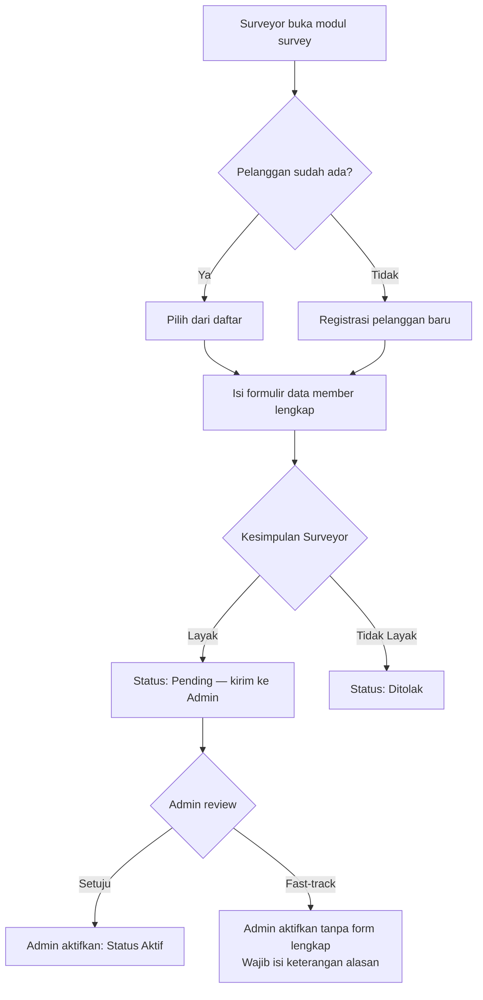
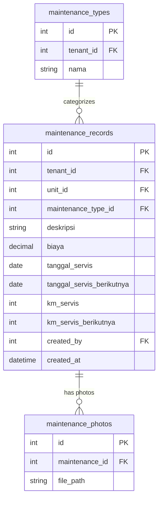

# DRENT — Product Requirements Document
## Part 6 of 7: Modul Pendukung

---

## Navigasi Dokumen

| Bagian | File |
|--------|------|
| Part 1 — Overview & Tech Stack | `DRENT_PRD_01_overview.md` |
| Part 2 — User & Akses | `DRENT_PRD_02_user_akses.md` |
| Part 3 — Data Master | `DRENT_PRD_03_data_master.md` |
| Part 4 — Booking & Transaksi | `DRENT_PRD_04_booking_transaksi.md` |
| Part 5 — Keuangan & Cek Fisik | `DRENT_PRD_05_keuangan_cek_fisik.md` |
| **Part 6 — Modul Pendukung** | `DRENT_PRD_06_modul_pendukung.md` ← Kamu di sini |
| Part 7 — Non-Fungsional & Resolved Decisions | `DRENT_PRD_07_nonfungsional.md` |

---

## 8. Modul Survey Member

### 8.1 Alur Survey

> Formulir member penuh mencakup data identitas, pekerjaan, keluarga, dan sosial. Lihat [Part 3 — Data Master, Seksi 4.5](DRENT_PRD_03_data_master.md) untuk field lengkap.

### 8.2 Fast-Track Activation

Dalam kondisi tertentu, Admin dapat langsung mengaktifkan status member tanpa melalui pengisian formulir lengkap. Aktivasi ini **wajib dicatat** dengan keterangan alasan.

---

## 9. Modul Pemeliharaan Unit

### 9.1 Pencatatan Pemeliharaan

Teknisi menginput seluruh kegiatan pemeliharaan dan pengeluaran per unit kendaraan.

| Field | Keterangan |
|-------|------------|
| `unit_id` | Relasi ke unit kendaraan (lihat [Part 3](DRENT_PRD_03_data_master.md)). |
| `tipe_pemeliharaan` | Pilih dari daftar (servis rutin, ganti ban, ganti sparepart, dll). Daftar dikelola oleh Admin. |
| `deskripsi` | Keterangan detail kegiatan. |
| `biaya` | Total biaya pemeliharaan. |
| `tanggal_servis` | Tanggal dilakukan pemeliharaan. |
| `tanggal_servis_berikutnya` | Opsional. Jadwal pemeliharaan berikutnya. |
| `km_servis` | Odometer saat servis. |
| `km_servis_berikutnya` | Opsional. Target KM untuk servis berikutnya. |
| `foto_nota` | Upload foto nota / bukti servis. |

### 9.2 Transaksi Lainnya

Pencatatan pengeluaran umum yang tidak terkait langsung dengan transaksi sewa atau pemeliharaan unit. Kategori pengeluaran diambil dari tabel master yang dikelola oleh Admin/Teknisi.

### 9.3 Database Schema — Pemeliharaan

---

## 10. Dashboard & Laporan

### 10.1 Dashboard Utama

Dashboard menampilkan ringkasan operasional per branch (atau lintas branch untuk Super Admin / Admin Branch).

#### KPI Cards

- Jumlah transaksi aktif (`Rental Unit`) hari ini.
- Jumlah booking baru (`Follow Up` & `Confirm`) yang perlu ditindaklanjuti.
- Total piutang outstanding.
- Unit yang sedang dalam pemeliharaan.
- Driver dengan saldo operasional sisa (belum dikembalikan).

#### Grafik & Visualisasi

- Revenue per bulan (bar chart, 12 bulan terakhir).
- Utilisasi unit per kendaraan (persentase hari terpakai vs. hari tersedia).
- Status distribusi booking (pie chart: Follow Up / Confirm / Waiting List / Rental Unit).
- Top konsumen berdasarkan jumlah transaksi dan total nilai.
- Komposisi revenue: unit sendiri vs. rent-to-rent.

### 10.2 Laporan

| Laporan | Deskripsi |
|---------|-----------|
| **Laporan Transaksi** | Daftar semua transaksi dengan filter status, branch, periode, konsumen, unit. |
| **Laporan Piutang** | Outstanding piutang per konsumen, per periode. |
| **Laporan Rent-to-Rent** | Hutang ke setiap pemilik rental mitra per periode. |
| **Laporan Operasional Driver** | Riwayat saldo dan penggunaan per driver. |
| **Laporan Kas** | Pemasukan dan pengeluaran per periode, per branch. |
| **Laporan Pemeliharaan** | Riwayat dan biaya servis per unit. |
| **Laporan Utilisasi Unit** | Hari terpakai vs. tersedia per unit dalam periode tertentu. |
| **Laporan Revenue** | Total pendapatan, modal, margin per periode dan per branch. |

> Semua laporan dapat di-export ke **PDF dan CSV**. Filter minimal: Branch, Periode (dari–sampai), dan filter spesifik per laporan.

---

## 11. Notifikasi In-App

### 11.1 Cakupan Notifikasi

Fase 1 hanya menggunakan notifikasi in-app. **Tidak ada integrasi WhatsApp atau email** pada fase ini.

| Event | Penerima |
|-------|----------|
| Booking baru masuk | CS, Admin |
| Booking berubah menjadi Follow Up (tanpa DP) | CS yang membuat booking |
| Invoice baru di-generate oleh Finance | CS terkait |
| Bon driver berhasil divalidasi Finance | CS terkait |
| Saldo driver kurang / perlu ditambah | Finance |
| Unit akan jatuh tempo servis (H–7 dan H–1) | Admin, Teknisi |
| Masa berlaku member hampir habis (H–30) | Surveyor, Admin |

---

*Kembali ke: [Part 5 — Keuangan & Cek Fisik](DRENT_PRD_05_keuangan_cek_fisik.md)*
*Lanjut ke: [Part 7 — Non-Fungsional & Resolved Decisions](DRENT_PRD_07_nonfungsional.md)*
