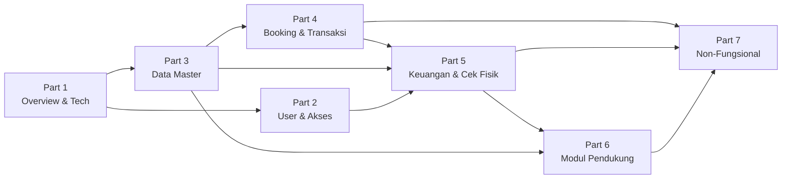

# DRENT — Product Requirements Document
## Part 7 of 7: Non-Fungsional & Resolved Decisions

---

## Navigasi Dokumen

| Bagian | File |
|--------|------|
| Part 1 — Overview & Tech Stack | `DRENT_PRD_01_overview.md` |
| Part 2 — User & Akses | `DRENT_PRD_02_user_akses.md` |
| Part 3 — Data Master | `DRENT_PRD_03_data_master.md` |
| Part 4 — Booking & Transaksi | `DRENT_PRD_04_booking_transaksi.md` |
| Part 5 — Keuangan & Cek Fisik | `DRENT_PRD_05_keuangan_cek_fisik.md` |
| Part 6 — Modul Pendukung | `DRENT_PRD_06_modul_pendukung.md` |
| **Part 7 — Non-Fungsional & Resolved Decisions** | `DRENT_PRD_07_nonfungsional.md` ← Kamu di sini |

---

## 12. Persyaratan Non-Fungsional

### 12.1 Performa

- Response time API **≤ 500ms** untuk operasi standar (CRUD, list dengan pagination).
- Kalender timeline (Gantt, lihat [Part 4](DRENT_PRD_04_booking_transaksi.md)) harus dapat merender **50+ unit** tanpa lag berarti.
- Upload foto (cek fisik, lihat [Part 5](DRENT_PRD_05_keuangan_cek_fisik.md)) harus ada **kompresi otomatis** sebelum upload (target ≤ 1MB per foto).

### 12.2 Keamanan

- Seluruh endpoint API diproteksi dengan **Laravel Sanctum**.
- Setiap request divalidasi `branch_id` user yang login — tidak bisa akses data branch lain.
- Role & permission dicek di **middleware backend**, bukan hanya di frontend.
- File upload divalidasi tipe dan ukuran di backend.
- **Audit log** untuk perubahan data kritis: status transaksi, invoice, pembayaran.

### 12.3 Skalabilitas (Persiapan SaaS Fase 2)

| Requirement | Detail |
|-------------|--------|
| `tenant_id` di semua tabel | Non-negotiable. Tambahkan dari Fase 1 meski hanya ada satu tenant. |
| Global Scope Eloquent | Diterapkan untuk multi-branch (`branch_id`) pada semua model. |
| Konfigurasi modul di database | Tidak ada logika bisnis yang hardcode asumsi single tenant. |
| Tidak ada coupling ke single tenant | Setiap query harus bisa di-scope ke tenant tanpa refactor besar. |

### 12.4 UX & Aksesibilitas

| Konteks | Requirement |
|---------|-------------|
| **Modul Cek Fisik** | Desain mobile-first, touch-friendly, akses kamera langsung dari browser. |
| **Modul Driver (bon)** | Desain mobile-first. Driver tetap mengakses via mobile browser. |
| **Modul lainnya** | Desain desktop-first, optimasi untuk kerja cepat (keyboard shortcut, autocomplete). |
| **Status transaksi** | Selalu terlihat jelas dengan badge berwarna yang konsisten di seluruh halaman. |
| **Aksi destruktif** | Konfirmasi dialog wajib (void invoice, ubah status final, hapus data master). |

### 12.5 Retensi Data

- Data transaksi disimpan aktif selama **1 tahun**.
- Setelah 1 tahun, data dapat **diarsipkan** (tidak dihapus permanen).
- Semua transaksi dalam mata uang **IDR only**. Tidak ada fitur multi-currency.

---

## 13. Resolved Decisions

Semua keputusan di bawah ini sudah dikonfirmasi dan sudah tercermin di bagian PRD terkait.

| No. | Keputusan | Jawaban | Diimplementasikan di |
|-----|-----------|---------|----------------------|
| 1 | Format nomor invoice | Bebas, dihasilkan otomatis per branch. | [Part 5 — Invoice PDF](DRENT_PRD_05_keuangan_cek_fisik.md) |
| 2 | Input bon driver | Driver tetap punya akun, input bon sendiri via mobile. Driver tidak tetap: setor fisik ke Finance, Finance yang input. | [Part 2 — Role Driver](DRENT_PRD_02_user_akses.md), [Part 5 — Operasional Driver](DRENT_PRD_05_keuangan_cek_fisik.md) |
| 3 | Approval saldo driver | Finance yang input saldo driver (tidak ada workflow CS → Finance). | [Part 5 — Operasional Driver](DRENT_PRD_05_keuangan_cek_fisik.md) |
| 4 | Pengelola metode pembayaran per branch | Admin Branch. | [Part 2 — User & Akses](DRENT_PRD_02_user_akses.md) |
| 5 | Template invoice PDF per branch | Bisa berbeda, hanya pada logo, kontak, dan alamat. Layout tetap sama. | [Part 5 — Invoice PDF](DRENT_PRD_05_keuangan_cek_fisik.md) |
| 6 | PDF cek fisik tersimpan per transaksi | Ya, bisa di-download ulang dari halaman detail transaksi. | [Part 5 — Cek Fisik](DRENT_PRD_05_keuangan_cek_fisik.md) |
| 7 | Retensi data transaksi | 1 tahun aktif, setelah itu diarsipkan. | Seksi 12.5 di atas |
| 8 | Multi-currency | Tidak. Semua transaksi dalam IDR. | Seksi 12.5 di atas |
| 9 | Cek fisik / checklist serah terima unit per transaksi | Ya, ter-record per transaksi (pre-departure & post-return). | [Part 5 — Cek Fisik](DRENT_PRD_05_keuangan_cek_fisik.md) |

---

## Ringkasan Referensi Antar Bagian

---

*Dokumen ini adalah bagian terakhir dari PRD DRENT v1.0.*
*Kembali ke awal: [Part 1 — Overview & Tech Stack](DRENT_PRD_01_overview.md)*

---

> **Confidential — Internal Use Only**
